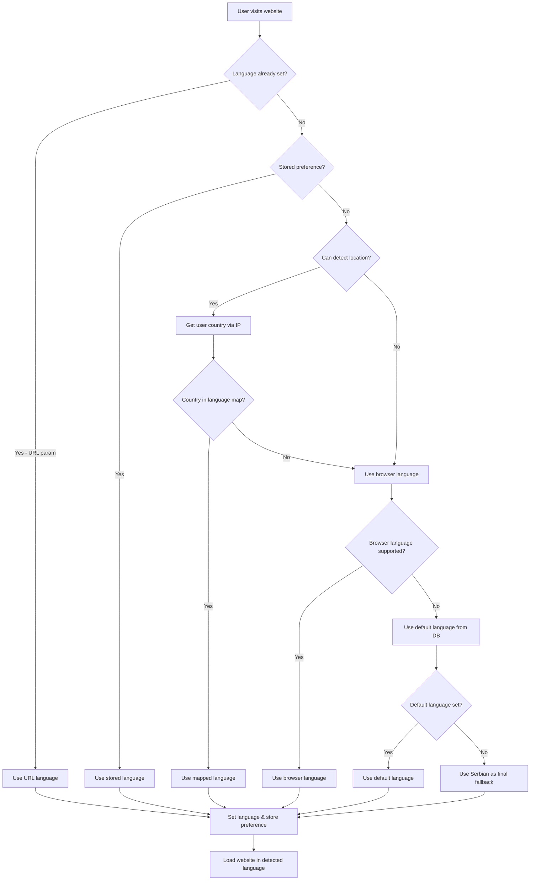

# Language Detection Flow

## Priority Order

1. **URL Parameter** (`?lang=xx`) - Highest priority
2. **Stored Preference** (localStorage) - User's previous choice
3. **Geolocation** (IP-based country detection) - New feature
4. **Browser Language** (navigator.language) - Previous fallback
5. **Database Default** (languages table) - Admin-defined default
6. **Serbian** - Final fallback

## Country-Language Mapping

| Country Code | Country Name | Language Code | Language Name |
|--------------|--------------|---------------|---------------|
| RS | Serbia | sr | Serbian |
| BA | Bosnia and Herzegovina | sr | Serbian |
| ME | Montenegro | sr | Serbian |
| HR | Croatia | sr | Serbian* |
| MK | North Macedonia | sr | Serbian* |
| SI | Slovenia | sr | Serbian* |
| DE | Germany | de | German |
| AT | Austria | de | German |
| CH | Switzerland | de | German* |
| US | United States | en | English |
| GB | United Kingdom | en | English |
| CA | Canada | en | English* |
| AU | Australia | en | English |
| NZ | New Zealand | en | English |

*Note: Some countries have multiple official languages, but we map to the most appropriate one for our audience.

## Implementation Details

The language detection is implemented in the `LanguageProvider.tsx` component using the following approach:

1. **IP Geolocation Service**: Uses https://ipapi.co/json/ to determine the user's country
2. **Country Mapping**: Maps country codes to preferred languages
3. **Fallback Chain**: If geolocation fails, falls back to browser language detection
4. **Persistent Storage**: Stores the detected language in localStorage for future visits
5. **Error Handling**: Gracefully handles API failures and uses appropriate fallbacks

This system ensures that users are automatically presented with content in their most likely preferred language, improving user experience and engagement.