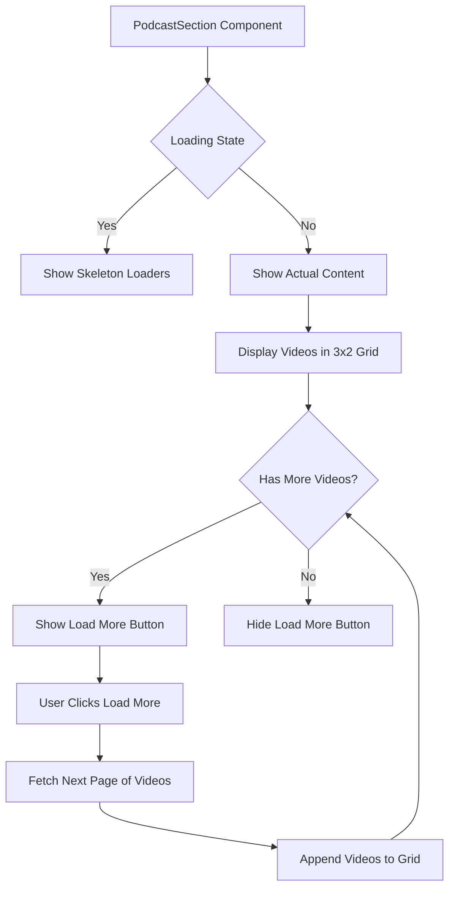

# Podcast Section Functionality

## Component Structure



## Data Flow

1. **Initial Load**:
   - Component mounts
   - Fetch first 6 videos from database
   - Load translations for current language
   - Display videos in grid layout

2. **Pagination**:
   - When "Load More" is clicked:
     - Calculate next page (current items / 6)
     - Fetch next 6 videos from database
     - Append to existing video list
     - Update "has more" state

3. **Video Display**:
   - Each video displayed in a card with:
     - Embedded video player (for social videos)
     - Placeholder for images or missing content
     - Media type indicator

## Database Structure

```
media table:
- id: UUID
- section_key: 'podcast'
- media_type: 'social_video' | 'image'
- file_url: string (for images)
- social_url: string (for embedded videos)
- thumbnail_url: string
- display_order: integer
- is_active: boolean
- created_at: timestamp
- updated_at: timestamp
- language_code: 'sr' | 'en' | 'de'
```

## Implementation Details

### Grid Layout
- Uses CSS Grid with responsive columns:
  - 1 column on mobile (max-width: 768px)
  - 2 columns on tablet (768px - 1024px)
  - 3 columns on desktop (1024px+)

### Pagination
- Items per page: 6
- Uses Supabase range queries for pagination
- Tracks "has more" state based on returned item count

### Loading States
- Initial loading: Skeleton loaders
- Load more button: Disabled with loading text
- Error handling: Console logging with graceful degradation

### Translations
- Uses existing translation system
- Keys:
  - podcastTitle: Section title
  - loadMore: Load more button text
  - loading: Loading state text

## User Experience

1. **Performance**:
   - Initial load shows only first 6 videos
   - Reduces initial page load time
   - Improves perceived performance

2. **Interaction**:
   - Clear visual feedback when loading
   - Hover effects on video cards
   - Responsive button states

3. **Accessibility**:
   - Proper iframe titles
   - Semantic HTML structure
   - Sufficient color contrast

## Future Enhancements

1. **Search/Filter**:
   - Search by title or description
   - Filter by date or media type

2. **Video Details**:
   - Title and description for each video
   - View count or date information

3. **Improved Loading**:
   - Infinite scroll instead of button
   - Progress indicators

4. **Video Analytics**:
   - Track video views
   - Popular videos section